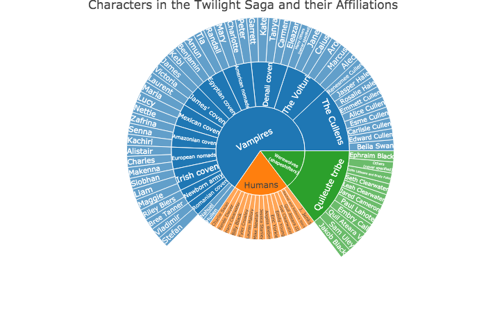

$$\\[.25in]$$

### Who am I?

\newpage
  

:::::::::::::: {.columns}
::: {.column width="60%"}

Ahh the question we are all trying to answer... below is a brief synopsis 

$$\\[.03in]$$
 

My name is Sophia Drewry, and I am from Kennesaw, GA. Here at UGA, I am a second year MPH student with a concentration in Epidemiology. My interests lie in infectious disease epidemiology, specifically arboviruses and the ecological dynamics of such mosquito-borne diseases. In the past, I have done research on dengue seroprevalence & climate effects on aedes aegypti disease transmission. This summer, I started to work on an evaluation of Puerto Rico’s passive vs. sentinel dengue surveillance programs. Like most of us in the public health world, I have been pulled into Covid-19 projects. You can check out my other website in the making [here.](http://sophiadrewry.com/)

:::
::: {.column width="40%"}

:::
::::::

### Course Goals

This semester, I hope to really get my hands dirty with data analysis.  I have about 2 years of _light_ R use and I would describe myself as a confident novice using R and Github. 

In this class I hope to...

* Build a solid foundation in biostatistical analysis methods
* Improve my data organization skills, ex. properly documenting my code in R markdown
* Learn about "machine learning", as that is someting I have no experience in

$$\\[.25in]$$

### Outside of class

I have quite a few hobbies outside of school, and I am almost always working on an art project. I love to cook and experiment with food as well. My biggest claim to fame is that I was actually featured on a Bon Appetite food podcast in 2018 after submitting a freelance article about eating in the shower. Unfortunately, I have yet to be recognized in public or sign any autographs. 

Other hobbies include:

* Making cats jump on walls with laser pointers
* Sitting on a porch and reading (the Twilight saga or historical fiction)
* Learning to play the piano 

$$\\[.25in]$$

### One for the road

When looking to improve up my R coding skills a while back, I came across [this](https://www.reed.edu/math/241/2020/05/27/vampires-plots-and-interactivity-oh-my/) comparison analysis of the Twilight saga books, movie scripts and sound track lyrics. It is actually a great learning tool for creating interactive plots with various packages. I am a _huge_ Twilight fan so I found this pretty entertaining. 

Here is the PNG form of a sample plot:

 
$$\\[.25in]$$
"Last compiled on `r format(Sys.time(), '%d %B, %Y')`"
