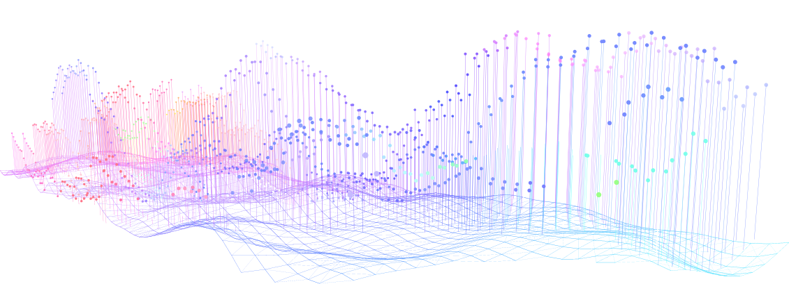

$$\\[.30in]$$

###  Hello and welcome to my data analysis portfolio. 
My name is Sophia Drewry and this website houses some of my coding work I have done as a student at the University of Georgia. 
Up above you can check out my past projects that are also housed on my [Github](https://github.com/sophiadrew). This portfolio was originally for my Modern Applied Data Analysis class, taught by my advisor Dr. Andreas Handel, but I have since merged it with my main portfolio/ website [here](http://sophiadrewry.com/). 

$$\\[.15in]$$

### Here is a brief summary of my more recent projects:

 - [Machine Learning Modeling](https://sophiadrew.github.io/SophiaPDrewry-MADA-Portfolio/files/analysis3%20copy.html) uses @Brian Mckays data to predict body temperature in flu patients
 - [El Nino/La Nina Dengue Modeling Project](https://sophiadrew.github.io/SophiaPDrewry-MADA-Portfolio/files/manuscript-copy.html) I try and predict dengue incidence using weather NOAA data on El Nino/La Nina and dengue cases records from Iquitos Peru. 
 - [California Air Quality Index and Covid-19 outcomes](/) Is a spatial analysis of California AQI estimates and cumulative Covid-19 outcomes from March 2020-December 2021. This is not published yet, but check back soon!
 
Full reproducible analysis repository for all projects can be found on my [Github](https://github.com/sophiadrew)

$$\\[.15in]$$

