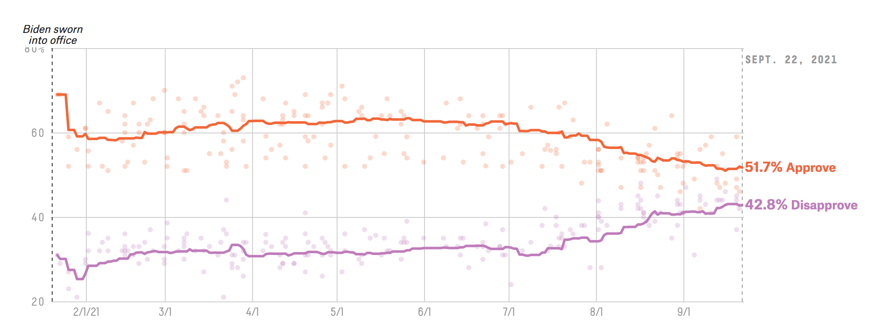

How Americans View Biden's Response To The Coronavirus Crisis

[Here](https://projects.fivethirtyeight.com/coronavirus-polls/) is the original article
[Here](https://github.com/fivethirtyeight/covid-19-polls) is the github repository

This is the table I am trying to replicate



# Load packages

```{r}
library(knitr) # to put this on my website
library(dplyr) 
library(ggplot2) 
library(here) #to define paths
library(lubridate) #to arrange date form of data
```
# Load data
This data can be found on FiveThirtyEight's github page. I used the adjusted verion
Now lets load the data

```{r}
dataspot1 <- here::here("data", "covid_approval_polls_adjusted.csv")
covid_approval_polls_adjusted <- read.csv(dataspot1)
# This dataset includes the approval and disapproval scores
dataspot2 <- here::here("data", "covid_approval_toplines.csv")
covid_approval_toplines <- read.csv(dataspot2) 
# This data set is for the line
```
# Clean data
Lets get an overview of the data
```{r}

str(covid_approval_polls_adjusted)
str(covid_approval_toplines)
```

# Lets make the data more managable
```{r}
biden <- covid_approval_polls_adjusted %>% 
     filter(subject %in% c("Biden")) %>%
     filter(party %in% c("all")) %>%
     select(startdate, approve_adjusted, disapprove_adjusted)
```
# Convert character into date format using lubridate package
```{r}
# Well after an hour of running code that does not work, I figured out that the problem was that the date is not in "date" form
# headbang
# headbang
# headbang

biden$startdate <- mdy(biden$startdate)     
```

# Now lets build out plot
```{r}
# Hex code for colors are 
# Orange = #EF813F
# Purple = #D78CDB

s1 <- ggplot() + 
     geom_point(data = biden, mapping=aes(x=startdate, y=approve_adjusted), alpha = 0.2, color = "#EF813F") + 
     geom_point(data = biden, mapping=aes(x=startdate, y=disapprove_adjusted), alpha = 0.2, color = "#D78CDB") +
     xlab(" ") +
     ylab(" ") + ylim(20, 80)

# No x or y axis titles because there are none in the model graph
print(s1)

```

# Now to do a similar process with the line data
```{r}
bidenline <- covid_approval_toplines %>% 
     filter(subject %in% c("Biden")) %>%
     filter(party %in% c("all")) %>%
     select(modeldate, approve_estimate, disapprove_estimate)

#Proper date format
bidenline$modeldate <- mdy(bidenline$modeldate) # Will not forget this again!

#Now for the plot
l1 = ggplot() + 
    geom_line(data = bidenline, aes(x = modeldate, y = approve_estimate), color = "#EF813F") +
    geom_line(data = bidenline, aes(x = modeldate, y = disapprove_estimate), color = "#D78CDB") +
    xlab(" ") +
    ylab(" ") + ylim(20, 80)

print(l1)
```


# Ok this is looking good. Now to combine both graphs
```{r}
BigGraph = ggplot() + 
    geom_point(data = biden, mapping=aes(x=startdate, y=approve_adjusted), alpha = 0.3, color = "#EF813F") + 
    geom_point(data = biden, mapping=aes(x=startdate, y=disapprove_adjusted), alpha = 0.3, color = "#D78CDB") +
    geom_line(data = bidenline, aes(x = modeldate, y = approve_estimate), color = "#EF813F", size = 1.5) +
    geom_line(data = bidenline, aes(x = modeldate, y = disapprove_estimate), color = "#D78CDB", size = 1.5) +
    xlab(" ") +
    ylab(" ") + ylim(20, 80) +
    scale_x_date( date_breaks = "1 month", date_labels = "%m/%d") +
    theme_bw() +
    annotate("text", x = as.Date("2021-01-21"), y = 80,
           label = "Biden sworn \ninto office",
           color = "black",
           size = 2,
           fontface = 1,
           vjust = 1,
           hjust = 0) +
    annotate("text", x = as.Date("2021-09-21"), y = 42, 
           label = "42.7% Disapprove", 
           color = "#D78CDB", 
           size = 4, 
           fontface = 2,
           vjust = 1,
           hjust = 0) +
    annotate("text", x = as.Date("2021-09-21"), y = 51, 
           label = "51.7% Approve", 
           color = "#EF813F", 
           size = 4, 
           fontface = 2,
           vjust = 1,
           hjust = 0)
print(BigGraph)
```  


Lets compare to original graph


# Now to add some theme elements
```{r}
BigGraph2 = ggplot() + 
    geom_point(data = biden, mapping=aes(x=startdate, y=approve_adjusted), alpha = 0.3, color = "#EF813F") + 
    geom_point(data = biden, mapping=aes(x=startdate, y=disapprove_adjusted), alpha = 0.3, color = "#D78CDB") +
    geom_line(data = bidenline, aes(x = modeldate, y = approve_estimate), color = "#EF813F", size = 1.5) +
    geom_line(data = bidenline, aes(x = modeldate, y = disapprove_estimate), color = "#D78CDB", size = 1.5) +
    xlab(" ") +
    ylab(" ") + ylim(20, 80) +
    theme_light (base_size=12, base_family="mono") +
    theme(
        panel.grid.minor.x = element_blank(),
        panel.grid.minor.y = element_blank(),  
        axis.line.y.left = element_line(color = "#D3D3D3", linetype = 2),
        axis.line.y.right = element_line(color = 	"#D3D3D3", linetype = 2),
        axis.line.x = element_line(color = 	"#D3D3D3"),
        axis.text = element_text(colour = "#D3D3D3"),
        axis.title = element_text(colour = "#D3D3D3"),
        axis.ticks = element_line(colour = "#D3D3D3"),
        aspect.ratio=2/6) +
    scale_x_date( date_breaks = "1 month", date_labels = "%m/%d") +
    annotate("text", x = as.Date("2021-01-21"), y = 80,
           label = "Biden sworn \ninto office",
           color = "black",
           size = 2,
           fontface = 1,
           vjust = 1,
           hjust = 0) +
    annotate("text", x = as.Date("2021-09-21"), y = 42, 
           label = "42.7% Disapprove", 
           color = "#D78CDB", 
           size = 4, 
           fontface = 2,
           vjust = 1,
           hjust = 0) +
    annotate("text", x = as.Date("2021-09-21"), y = 51, 
           label = "51.7% Approve", 
           color = "#EF813F", 
           size = 4, 
           fontface = 2,
           vjust = 1,
           hjust = 0) 
print(BigGraph2)
```


# Save all my hard work
```{r}
figure_file = here::here("BigGraph2.png")
ggsave(filename = figure_file, plot=BigGraph2, dpi = 300) 
```